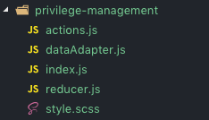

# react-redux-kit

react-redux-kit 是一个 react、redux 项目的工具箱，适合用于大型复杂的 react 项目，主要是提供模板代码的生成。


## 如何使用

1. 安装

   ```
   npm i react-redux-kit -g
   ```

2. 使用

   ```text
   # 目前仅支持生成业务组件代码(后续会加入更多功能)
   
   # 第一步: 进入到组件的存放目录
   cd ~/your-project/components
   
   # 第二步: 运行命令
   > rrk biz
   
   # 输入组件的名称
   ? 请输入业务组件名称(CamelCase命名风格): PrivilegeManagement
   业务组件创建成功
   
   ```

3. 查看生成的文件

   
